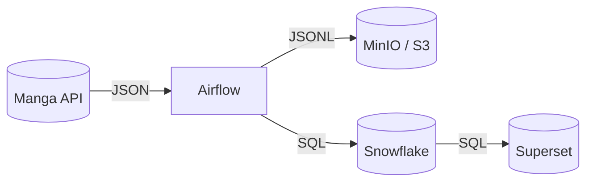

# 📊 MangaLake

**End-to-end data pipeline for manga metadata processing and analytics**

Manga Lakehouse is a pet-project to show the Data Lakehouse concept with manga metadata.
It uses Airflow for orchestration, MinIO for storage, Snowflake for analytics, and Superset for visualization.
The project runs in Docker containers, can be set up with a .env file, and lets you see the full way “API → Lake → Warehouse → BI” in just a few minutes.

## 🏗️ Architecture

📊 Data Flow Pipeline



### 🛠️ Technology Stack

- 🔄 Orchestration: Apache Airflow (LocalExecutor + Triggerer)
- 💾 Object Storage: MinIO (S3-compatible)
- 🏢 Data Warehouse: Snowflake
- 📈 Business Intelligence: Apache Superset
- 🐍 Runtime: Python
- 🐳 Containerization: Docker & Docker Compose

## ✨ Features

- Automatic data loading: get manga data from APIs on schedule
- Storage: keep files in MinIO (S3-compatible object storage)
- Data warehouse: use Snowflake for analytics
- Dashboards: view and explore data with Superset
- Docker setup: run everything inside containers
- Error handling: retries and backup APIs if something fails
- Data quality: clean ODS layer and simple dimensional models

## 🚀 Quick Start

### Prerequisites

- Docker & Docker Compose
- Snowflake account and credentials
- Internet connection for API access

### Installation

1. Clone the repository
   ```bash
   git clone https://github.com/qusakabi/mangalake.git
   cd mangalake
   ```

2. Configure environment
   ```bash
   cp env.example .env
   ```
   Edit .env with your configuration (see Configuration section below). Template: [`env.example`](env.example)

3. Start services
   ```bash
   docker compose up -d --build
   ```

4. Access the applications
   - 🔄 Airflow: http://localhost:8081
   - 💾 MinIO Console: http://localhost:9001 (minioadmin / minioadmin)
   - 📈 Superset: http://localhost:88 (admin / admin)

5. Run the pipeline
   - Open Airflow UI
   - Unpause all DAGs
   - Trigger raw_from_api_to_s3 — subsequent DAGs will run automatically

## ⚙️ Configuration

Create a .env file from [`env.example`](env.example) and configure:

### Required Settings

#### Snowflake Configuration
```env
SNOWFLAKE_ACCOUNT=your_account
SNOWFLAKE_USER=your_username
SNOWFLAKE_PASSWORD=your_password
SNOWFLAKE_WAREHOUSE=your_warehouse
SNOWFLAKE_DATABASE=your_database
SNOWFLAKE_SCHEMA=your_schema
```

#### MinIO Configuration
```env
MINIO_ENDPOINT_URL=http://minio:9000
MINIO_ACCESS_KEY=minioadmin
MINIO_SECRET_KEY=minioadmin
MINIO_BUCKET_NAME=manga-data
```

#### API Configuration (Optional)
```env
MANGA_API_BASE=https://api.mangadex.org
MANGA_API_FALLBACK=https://backup-api.example.com
REQUEST_TIMEOUT=30
REQUEST_RETRIES=3
```

Defaults and parsing live in [`etl/config.py`](etl/config.py).

## 📊 Data Pipeline

### DAGs Overview

#### 1. raw_from_api_to_s3
- Purpose: Fetches raw manga data from APIs
- Output: JSONL files in MinIO under raw/manga/load_date={{ ds }}/
- Schedule: Configurable (daily recommended)
- File: [`dags/raw_from_api_to_s3.py`](dags/raw_from_api_to_s3.py)

#### 2. raw_from_s3_to_snowflake
- Purpose: Transforms raw data and loads into ODS layer
- Dependencies: Waits for raw data availability
- Output: ODS_MANGA table in Snowflake
- File: [`dags/raw_from_s3_to_snowflake.py`](dags/raw_from_s3_to_snowflake.py)

#### 3. fct_count_day_manga
- Purpose: Creates daily manga counts by status
- Output: DM_MANGA_DAILY_COUNTS table
- File: [`dags/fct_count_day_manga.py`](dags/fct_count_day_manga.py)

#### 4. fct_avg_day_manga
- Purpose: Calculates average publication year by status
- Output: DM_MANGA_AVG_YEAR table
- File: [`dags/fct_avg_day_manga.py`](dags/fct_avg_day_manga.py)

### Data Models

#### ODS Layer
ODS_MANGA
```sql
- MANGA_ID (String): Unique identifier
- TITLE (String): Manga title
- STATUS (String): Publication status
- LAST_CHAPTER (Number): Latest chapter number
- YEAR (Number): Publication year
- TAGS (Array): Genre tags
- UPDATED_AT (Timestamp): Last update time
- LOAD_DATE (Date): ETL load date
```

#### Data Mart Layer
DM_MANGA_DAILY_COUNTS
```sql
- LOAD_DATE (Date): Processing date
- STATUS (String): Manga status
- COUNT_MANGA (Number): Count of manga
```

DM_MANGA_AVG_YEAR
```sql
- LOAD_DATE (Date): Processing date
- STATUS (String): Manga status
- AVG_YEAR (Number): Average publication year
```

DM_MANGA_SUMMARY
```sql
- LOAD_DATE (Date): Processing date
- YEAR (Number): Publication year
- STATUS (String): Manga status
- COUNT_MANGA (Number): Count of manga
```

## 📁 Project Structure

```
mangalake/
├── 🔄 dags/                    # Airflow DAG definitions
│   ├── raw_from_api_to_s3.py
│   ├── raw_from_s3_to_snowflake.py
│   ├── fct_count_day_manga.py
│   └── fct_avg_day_manga.py
├── 🔧 etl/                     # ETL logic and utilities
│   ├── config.py               # Configuration management
│   ├── extract/                # Data extraction modules
│   ├── transform/              # Data transformation logic
│   └── load/                   # Data loading utilities
├── 🐘 postgres/               # PostgreSQL configs (Airflow metadata)
├── 📊 superset/               # Superset configurations
├── 🐳 docker-compose.yml      # Multi-service orchestration
├── 📦 Dockerfile              # Container definition
├── 📋 requirements.txt        # Python dependencies
├── 🔧 env.example             # Environment template
└── 📝 README.md              # This file
```

## 🛠️ Operations

### Health Checks

```bash
# Check all services status
docker compose ps

# View service logs
docker compose logs airflow
docker compose logs minio
```

### Common Operations

#### Reprocess Data
```bash
# Clear and rerun pipeline for specific date
docker compose exec airflow-scheduler airflow dags backfill raw_from_api_to_s3 -s 2024-01-01 -e 2024-01-01
```

## 🔧 Troubleshooting

### Common Issues

❌ No Raw Files Found  
Problem: Downstream DAGs fail because raw files are missing  
Solution:
1. Check if raw_from_api_to_s3 completed successfully
2. Verify files exist in MinIO console
3. Check API connectivity and credentials

❌ Snowflake Connection Failed  
Problem: Cannot connect to Snowflake warehouse  
Solution:
1. Verify credentials in .env file
2. Check network connectivity
3. Ensure warehouse is running

❌ Superset Login Issues  
Problem: Cannot access Superset dashboard  
Solution:
- Default credentials: admin / admin
- Reset password if needed through container

